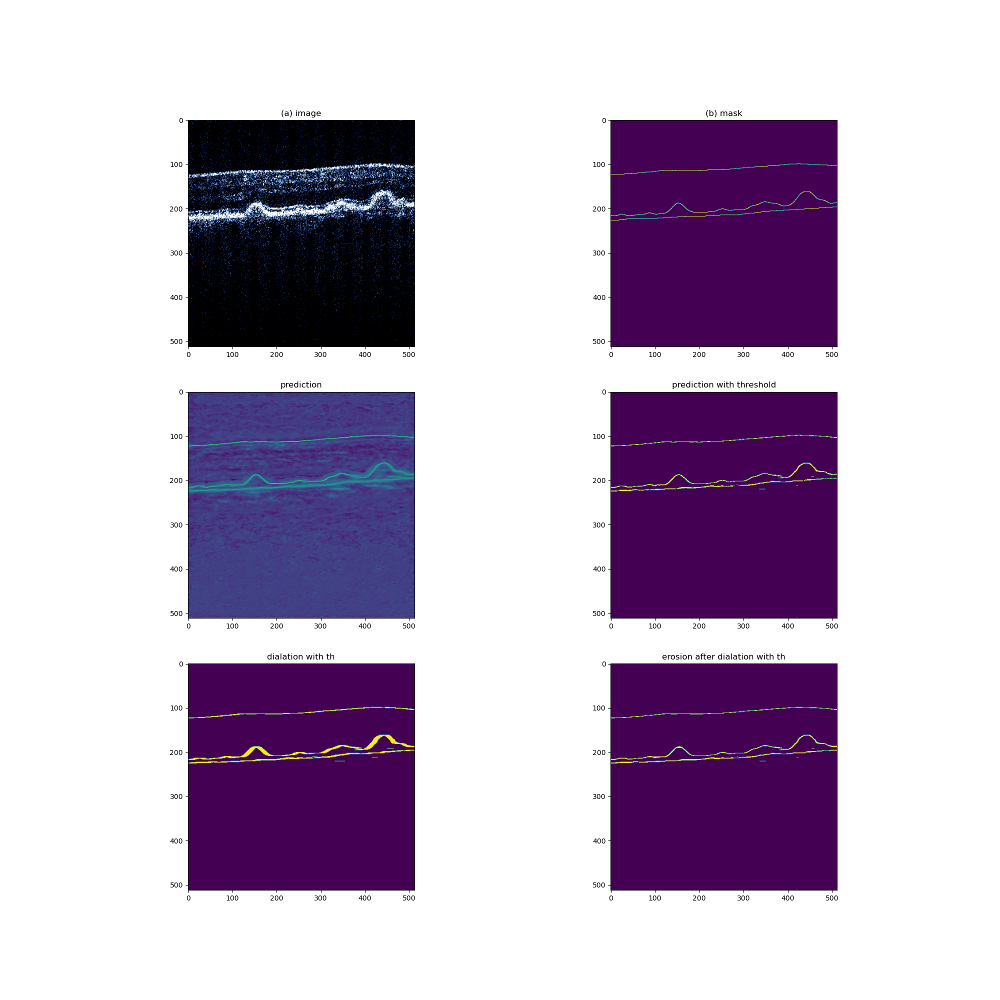

# RaRetina
Deep Learning algorithm for neurological segmentation of Optical Coherence Tomography images of human retina

Running the code:

CUDA_VISIBLE_DEVICES=0 python main.py --mode train --model_name transunet

## RaRetina

